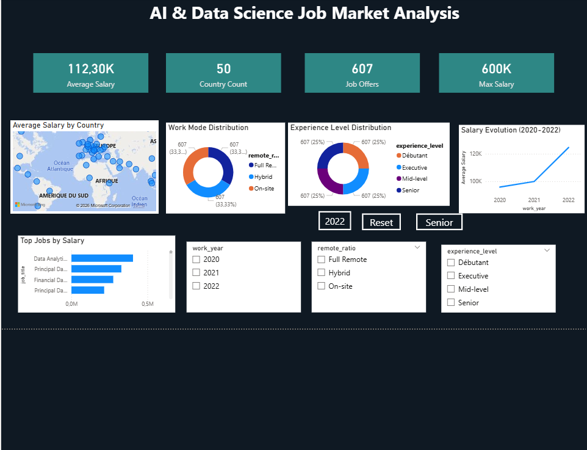
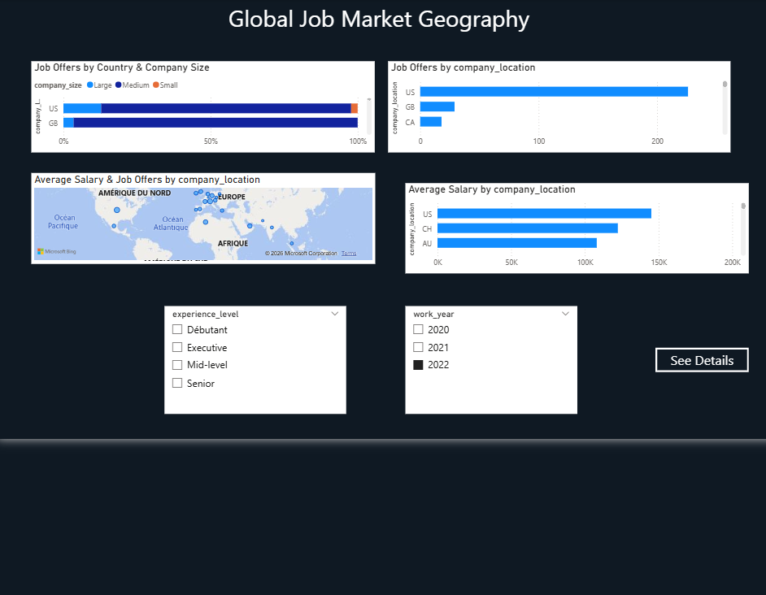

# AI & Data Science Job Market Analysis — Power BI Dashboard

An interactive Power BI dashboard analyzing the global AI, Data Science, and Big Data job market — salaries, experience levels, remote work trends, and geographic distribution — built on a professional star schema data model.

---

## Overview

This project transforms a raw job salaries dataset into a fully interactive, multi-page Power BI dashboard, following industry best practices for data modeling and DAX measure design.

**Key questions answered:**
- What are the average, minimum, and maximum salaries in AI/Data Science roles?
- How have salaries evolved between 2020 and 2022?
- Which job titles and countries pay the most?
- How is remote work distributed across the industry?
- What is the breakdown by experience level (Entry, Mid, Senior, Executive)?

---

## Dashboard Pages

### 1. Overview
General KPIs, salary trends, top-paying job titles, world map of salaries, experience level and remote work distribution.



### 2. Salary Deep Analysis
Detailed salary breakdown by job title and year (matrix), salary comparison by experience level, max vs min salary by role, and job title ranking.


### 3. Geography
World map, top 10 countries by salary and by number of offers, company size distribution by country.



### 4. Country Details (Drill-through)
Country-specific deep dive accessible via navigation button — salary by job title, experience and remote work breakdown for the selected country.


---

## Data Model — Star Schema

The dataset was restructured from a single flat table into a proper **star schema** for optimal performance and scalability:


```
              Dim_Temps
                  |
Dim_Pays —— Fact_Salaires —— Dim_JobTitle
                  |
            Dim_Experience
                  |
              Dim_Contrat
```

- **Fact_Salaires**: central fact table containing salary, remote ratio, company size, and foreign keys
- **Dim_Temps**: years (2020–2022)
- **Dim_JobTitle**: job titles
- **Dim_Pays**: countries
- **Dim_Experience**: experience levels (Entry, Mid, Senior, Executive)
- **Dim_Contrat**: employment types (Full-time, Part-time, Contract, Freelance)

All relationships are **one-to-many (1:*)** with single-direction cross-filtering, following standard BI modeling practices.

---

## DAX Measures

A dedicated `_Mesures` table holds all calculations, including:

- `Salaire Moyen`, `Salaire Max`, `Salaire Min` — core salary statistics
- `Nb Offres`, `Country Count` — volume indicators
- `Salary Growth` — year-over-year salary growth using `CALCULATE` + `FILTER` + `VAR`
- `Rank Metier` — dynamic job title ranking using `RANKX`
- `% Full Remote` — remote work share using `CALCULATE` + `DIVIDE`

Full documentation with explanations: [`documentation/dax_measures.md`](documentation/dax_measures.md)

---

## Features Implemented

- Power Query ETL: data cleaning, type correction, value mapping, custom columns
- Star schema data modeling with proper relationships
- Advanced DAX (VAR, CALCULATE, FILTER, RANKX, DIVIDE)
- Interactive slicers (year, experience level, employment type)
- Cross-filtering between visuals
- Drill-through navigation to country-level detail page
- Bookmarks for quick navigation (General View, 2022, Senior Only)
- Dark mode custom theme

---

## Tools & Skills

`Power BI Desktop` · `Power Query (M)` · `DAX` · `Data Modeling (Star Schema)` · `Data Visualization` · `Dashboard Design`

---

## Dataset

Source: [Data Science Job Salaries — Kaggle](https://www.kaggle.com/datasets/ruchi798/data-science-job-salaries)

607 job postings (2020–2022) across 50+ countries, covering salary, experience level, employment type, remote ratio, and company size.

---

## How to Use

1. Clone or download this repository
2. Open `dashboard/AI_JobMarket.pbix` with [Power BI Desktop](https://powerbi.microsoft.com/desktop/) (free)
3. Explore the pages using the navigation buttons
4. Use slicers and bookmarks to filter by year, experience level, or job type

---

## Key Insights

- Salaries increased consistently from 2020 to 2022
- The United States dominates both in number of offers and salary levels
- Senior-level roles represent the largest share of the job market
- Most positions offer either full remote or hybrid work arrangements

---

## Author

**Oumayma Iddouche**
Data Science & AI Engineering Student — ENSIASD
[LinkedIn](https://www.linkedin.com/in/oumayma-iddouche) · [GitHub](https://github.com/OumaymaIddouche)
